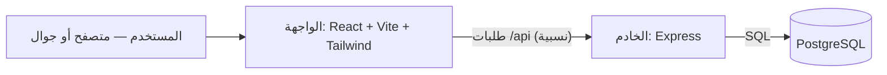

# مشروع تنظيم المضخات

تطبيق عربي (RTL) لإدارة المضخات والدياليات والحصص المائية اليومية، بواجهة موبايل أولًا — دفتر شخصي للمساهم، ولوحة تشغيل كاملة لصاحب المضخة، ولوحة مستقلة لمسؤول النظام.

> **الحالة:** المرحلة الثانية مكتملة — بيانات التشغيل والحسابات صارت على الخادم مع قاعدة بيانات PostgreSQL، والواجهة تصل إليها عبر مسار نسبي واحد `/api`. التفاصيل الكاملة في [`docs/phase2-backend-migration.md`](docs/phase2-backend-migration.md).

---

## البنية



خدمتان فقط: الواجهة (موقع ثابت بعد البناء) والخادم (API)، وكلاهما يتشارك نفس الأصل — لذلك `/api` يعمل في المعاينة وفي النشر دون أي تعديل أو رابط مكتوب في الكود.

---

## أوضاع الاستخدام

| الوضع | لمن | المدخل |
|---|---|---|
| **حساب على الخادم** | صاحب المضخة (مالك/مدير) أو المساهم | الشاشة الأولى: دخول · حساب جديد · نسيت كلمة المرور |
| **لوحة مسؤول النظام** | من يدير المستخدمين والمضخات والعضويات | تُفتح من تطبيق المسؤول |

> لا يوجد تسجيل حساب محلي في المتصفح: كل حساب يُنشأ على الخادم (رقم هاتف + كلمة مرور)، والصلاحيات تُفحص على الخادم لا في الواجهة.

---

## أين تُحفظ بيانات التشغيل

PostgreSQL هو المصدر الرسمي، ويُخزَّن الجهاز نسخة محلية تعمل بلا إنترنت:

| الحالة | ما يحدث عند فتح التطبيق |
|---|---|
| الجهاز فيه بيانات، والخادم فارغ | تُرفع بيانات الجهاز إلى الخادم مرة واحدة (مع نسخة احتياطية محلية قبل الرفع، وبلا حذف أي شيء) |
| الخادم فيه بيانات | تُنزَّل بيانات الخادم إلى الجهاز (بنسخة احتياطية محلية قبل الاستبدال) |
| جهاز جديد على مضخة مسجّلة | تُبنى المضخة وبياناتها من الخادم مباشرة — لا يُطلب تسجيل مضخة جديدة |
| لا إنترنت | يعمل التطبيق محليًا، وتُرفع التعديلات عند عودة الاتصال |

- المخزن يرتبط بـ **معرّف المضخة على الخادم** الذي يأتي من قائمة مضخات الحساب، لا بأي رقم محلي قديم.
- كل تعديل رسمي يُرفع بعد ثوانٍ (`PUT /api/pumps/:id/operating`)، والمزامنة الأولى تُعلَّم بـ `POST …/migrate-local`.
- حالة الحفظ ظاهرة أعلى الشاشة: «محفوظ على الخادم» · «جارٍ الحفظ…» · «لا يوجد اتصال بالإنترنت».
- المساهم يقرأ البيانات الرسمية للمضخات المعتمدة له من الخادم (قراءة فقط) على أي جهاز.

---

## المزايا

**وضع المالك / المدير**
- إعدادات المضخة التشغيلية: البئر، المزرعة، المحرك، الطاقة، ساعات التشغيل، سعر الديزل، الرواسة، وحدة الحصة والعملة.
- **مضخة واحدة هي الأصل**: المسؤول يدير مضخته من لوحة واحدة، وإن احتاج مضخة ثانية فالطريق الوحيد هو **مفتاح المضخات** الصغير داخل الإعدادات (إنشاء مضخة أخرى أو التبديل بينهما).
- الديالات: الرقم، البداية، عدد الأيام، الحالة، وتثبيت كشف الدوام أو إعادة فتحه.
- كشف مساهمي الديالة (نصيب بالدقائق لكل عضو) **مرجع واحد** يُدار في شاشة الديالات، ويُعرض في شاشة اليوم للقراءة فقط: لا يُعدَّل من هناك ولا **يحجز** أي ساعة تلقائيًا.
- **الدوام الفعلي** لهذا اليوم يُبنى مشاركًا مشاركًا: نافذة واحدة تُدخل الاسم والوقت («من … إلى …») والمدة، مع الديزل (مسدد/نقص/غير مسدد) والرواسة (نقد/أجل/جزء نقد وجزء أجل) وسبب النقص عند تقليل النصيب — والترتيب الزمني إلزامي (لا تداخل ولا خروج عن نافذة التشغيل) في الواجهة وفي المخزن.
- الدوام الفعلي اليومي، الاستخدام، الوقود (ساعات/لتر/ساعة/النقص/السعر)، الرواسة/المشغّل، التوقفات (عطل، مطر، وقود، طارئ…).
- المالية: الدفعات، الديون، الحركات والتكاليف، مع لقطات (snapshot) للأسعار وقت كل عملية.
- الناس والمساهمون، التقارير، وسجل تدقيق لكل عملية حساسة.

**وضع المساهم**
- دفتر شخصي لعدة مضخات: الدورات، الأدوار، توزيع الحصص اليومية بالدقائق والساعات، الوقود والرواسة، والتقارير.
- سجلات شخصية خاصة لا تختلط ببيانات المضخة الرسمية.
- مزامنة رسمية للبيانات المعتمدة من صاحب المضخة.

**لوحة مسؤول النظام**
- المستخدمون (تعيين، إعادة كلمة المرور، كشف الهاتف بصلاحية)، المضخات، العضويات والطلبات، سجل التدقيق، وإعدادات عامة للتطبيق.

**عام**
- عربي كامل مع RTL، وهوية بصرية كحلية (`#032a4c`) مع لوحة ألوان متنوّعة للأقسام، وإدخال أرقام موحّد في كل الحقول.
- **الوقت بصيغة 12 ساعة عربية** في كل الشاشات والحقول (`6:00 ص` · `3:30 م`) — دالة واحدة `formatTimeAmPm` في `src/domain/util.ts`، والتخزين يبقى 24 ساعة (`HH:MM`).
- **النطاقات الزمنية تُكتب من اليمين إلى اليسار**: `formatTimeRange` تُنتج `6:00 ص ← 9:00 ص` (البداية على اليمين، والسهم يشير إلى النهاية في اتجاه القراءة العربية) — بما في ذلك رسائل التداخل والتنبيهات.
- يعمل دون اتصال ويمكن تثبيته كتطبيق (PWA).
- **المصادقة والتصريح على الخادم** — لا في الواجهة.

---

## التقنيات

| الطبقة | المستخدم |
|---|---|
| الواجهة | React 19 · Vite 6 · TypeScript 5.8 · Tailwind CSS 4 · lucide-react · vite-plugin-pwa |
| الخادم | Node.js ≥ 20 · Express 4.21 · pg 8.13 |
| قاعدة البيانات | PostgreSQL |

التبعيات مثبَّتة بإصدارات محددة، والاستيراد لا يعتمد على أي رابط خادم مكتوب في الكود.

---

## هيكل المشروع

```
src/
  admin/        لوحة مسؤول النظام (المستخدمون، المضخات، العضويات، التدقيق، الإعدادات)
  manager/      وضع المالك/المدير (الديالات، الدوام، المالية، الناس، التقارير)
  shareholder/  وضع المساهم (الدورات، الأدوار، الحسابات، السجلات الشخصية)
  domain/       النموذج والمنطق والقواعد (rules = مصدر واحد للحساب والترتيب) والترحيل والمزامنة
  auth/ lib/    جلسة الحساب على الخادم وعميل الـ API ومولّدات المعرّفات
  components/ screens/  عناصر الواجهة المشتركة (ui · StatusPills · Brand) وشاشة الدخول
server/
  src/index.js  نقطة تشغيل الـ API
  src/db.js     اتصال PostgreSQL + المخطّط (كل الجداول بـ IF NOT EXISTS)
  src/routes/   auth · pumps · operating · admin
  src/          الحُرّاس، الأمان، التدقيق، الإعدادات، bootstrap
scripts/        توليد الأيقونات وفحوصات الحسابات والـ API
docs/           توثيق المرحلة الثانية ومراجعة جاهزية أندرويد
Dockerfile      نشر الخادم (node:20-alpine)
```

---

## التشغيل محليًا

**المتطلبات:** Node.js ≥ 20، وقاعدة PostgreSQL (رابط اتصال).

**1) الواجهة**

```bash
npm install
npm run dev          # يفتح Vite على المنفذ 5173، ويحوّل /api تلقائيًا إلى الخادم
```

**2) الخادم (طرفية ثانية)**

```bash
cd server
npm install
DATABASE_URL="postgresql://..." PORT=3001 node src/index.js
```

عند الإقلاع ينشئ الخادم الجداول الناقصة تلقائيًا (`IF NOT EXISTS`) — **لا يُحذف أي جدول أو عمود ولا تُفقد بيانات**، ثم يصبح جاهزًا على `/api`.

**متغيرات البيئة:** `DATABASE_URL` (مطلوب) و`PORT` (اختياري، الافتراضي 3001). لا تُكتب أي أسرار في الكود أو في المستودع.

**فحوصات سريعة:**

```bash
npm run verify                          # فحص منطق الحسابات (بلا خادم)
node scripts/verify-phase2-api.mjs      # فحص المرحلة الثانية (يحتاج الخادم يعمل)
curl http://localhost:3001/api/health   # {"ok":true,"service":"pump-api"}
```

---

## البناء والنشر

| الخدمة | البناء | الناتج |
|---|---|---|
| الواجهة | `npm run build` | مجلد `dist` (موقع ثابت + PWA) |
| الخادم | `Dockerfile` | صورة Node تشغّل `server/src/index.js` على المنفذ 3001 |

الواجهة تصل إلى خادمها عبر `/api` من نفس الأصل، فيكفي نشر الخدمتين معًا دون ضبط أي رابط.

---

## التوثيق

- [`docs/phase2-backend-migration.md`](docs/phase2-backend-migration.md) — جداول قاعدة البيانات، نقاط الـ API الجديدة، والصلاحيات.
- [`docs/android-audit.md`](docs/android-audit.md) — مراجعة الجاهزية لأندرويد.

---

## شعار التطبيق وأيقوناته

الشعار الرسمي في ملف واحد: `brand/app-icon-source.png` (يُحفظ في المستودع ولا يُنشر مع الموقع).
منه تُبنى كل الصور المشتقّة، وتتحكّم في:

| الملف | أين يظهر |
| --- | --- |
| `public/brand/app-icon.webp` | شاشة البدء، شاشة الدخول، رأس شاشات التطبيق، بطاقة الهوية في الإعدادات |
| `public/icons/icon-192.png` · `icon-512.png` | أيقونة التطبيق على الجوال وسطح المكتب (PWA) |
| `public/icons/apple-touch-icon.png` | أيقونة آيفون |
| `public/icons/icon-512-maskable.png` | أيقونة أندرويد التكيّفية (الشعار داخل المنطقة الآمنة) |

**عند تغيير الشعار:** ضع الصورة الجديدة مكان `brand/app-icon-source.png` ثم شغّل:

```bash
node scripts/gen-icons.mjs --from-brand
```

(يحتاج ImageMagick — يُستخدم عند إعداد الشعار فقط، لا في كل بناء.) السكربت يقتطع مربّع
الشعار من الصورة تلقائيًا (`scripts/artwork-box.mjs`)، يضع زوايا دائرية على خلفية هوية
التطبيق `#032a4c`، ويشتقّ الأيقونات الأربعة. الأيقونات الموجودة تبقى كما هي في البناء
العادي فلا تُستبدل بغيرها.

---

## المطوّر

برمجة المهندس / عبدالملك عامر
